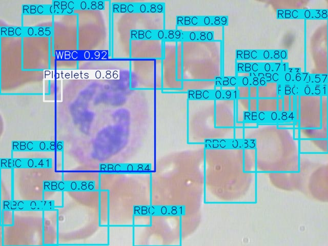

# Blood Cell Detection Web App

- Yolov11 Model is Fine Tuned On The BCCD Dataset With 410 Blood Sample Microscopic Images and there Annotation in Xml Files In `BCCD` Directory.

- Augmentation is Done Using Albumenation in `augmentation.py` Which Adjusts The Boundbox Coordinates According To Image which is being Augmented and It's Coordinates Saved in Xml file and Augmention of All Images Saved are saved in Save directory `BCCD/JPEGImages` Along With The Original image augmented annotations in `BCCD/Annotations` same as original Xml files.

- `annotaion.py` annots all the images kept in `BCCD/JPEGImages` and using xml files in `BCCD/Annotations`. Pillow a Python Library is used to Draw The Boundboxes.

- `data_structuring.py` Structures the images and the Labels are converted into yolo format using the old coordinates saved in corresponding xml files and a directory `dataset` is created :

   `dataset/
    ├── images/
    │   ├── train/
    │   │   ├── img1.jpg
    │   │   └── img2.jpg
    │   ├── val/
    │   └── test/
    └── labels/
        ├── train/
        │   ├── img1.txt
        │   └── img2.txt
        ├── val/
        └── test/`

- In `model_tuning.py` file the model `yolo11n.pt` is fine tuned with 100 epochs and instructions given in `dataset.yaml` is passed in model training shows the directory of dataset and the name/count of classes to detect. The Training Results are Saved in `runs/detect/train` , here's the preview of a plot loss updation during training :

- At Last `app.py` contains streamlit code which takes the uploaded image n feeded to model for inference , after that the boundboxes are drawn from results by inference along with classes it detected and each of there respective confidence.

Use this image for testing purposes :

The result image should look like this :

